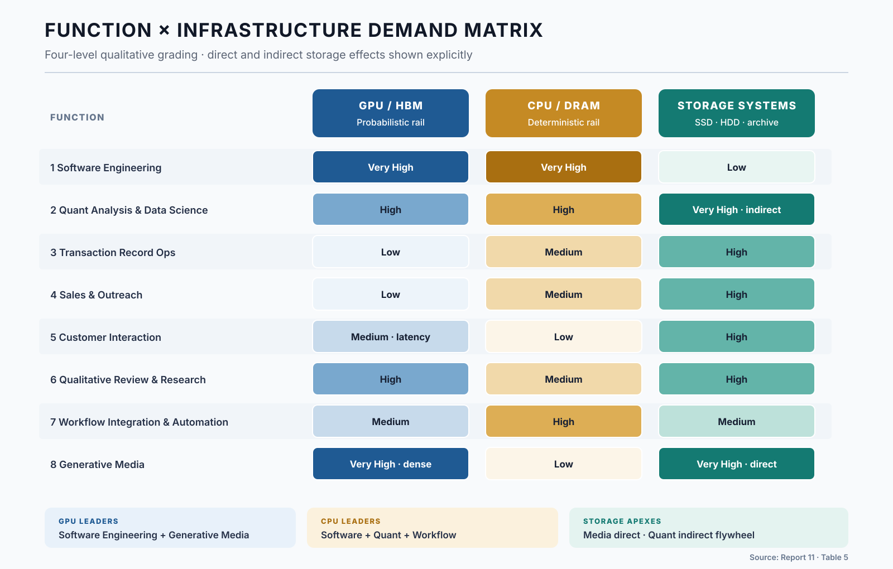

# Reading the Shadow onto Silicon
### Mapping AI Demand onto Compute, Memory, and Storage, 2026–2028

The Intelligence Economy — Report 11 of 14

Wisdom Hill Research | Thematic Research | September 2026

---

# 1. Executive Summary

Report 8 closed with the observation that token demand "is the shadow this sequence casts on the infrastructure market," and Report 10 extended the image: GPU-hours are the shadow of the second front, and "the companion infrastructure volume reads both shadows onto silicon together." This is that volume. Its mandate, promised repeatedly in both antecedent reports, is to convert two demand functions — the compute-weighted B2B token series of Report 8 and the GPU-hour media series of Report 10 — into hardware requirements. Its central methodological claim is that the conversion cannot be done onto a single hardware column. AI demand lands on **three infrastructures**, not one: the GPU/HBM complex that executes probabilistic inference, the CPU/DRAM complex that executes the deterministic code and orchestration surrounding it, and the Storage Systems complex (NAND SSD, HDD, and archival tiers) that absorbs the data agents generate and consume. A one-column model reads the shadow onto the wrong wall.

Four headline results organize the report. First, **the GPU column is quantified: on an H100-capacity-equivalent basis, the combined AI inference fleet grows from roughly 1,203,000 in 2026 to roughly 3,364,000 in 2028 — a 2.8-fold expansion — of which the B2B LLM fleet contributes 1,095,000 rising to 2,420,000 and the generative-media fleet 108,000 rising to 944,000.** To give those capacity-equivalents a physical scale: under a hypothetical all-H100-equivalent deployment at roughly 1.35 kW per unit inclusive of server, network, and cooling overhead, the requirement corresponds to on the order of 1.6 GW of facility load in 2026 and 4.5 GW in 2028, against a replacement-cost scenario on the order of $20–25 billion in the terminal year at blended 2028 unit prices. These are reference equivalents for conveying scale, not forecasts of the physical device mix, its power draw, or actual capital expenditure, which depend on a GPU/TPU/ASIC composition this report does not project. The fleet is decomposed function by function in Section 6, the analytical core of this report. Twelve core workloads are resolved — the seven LLM-based business functions of Report 8 and the five media-generation segments of Report 10, treated as peers rather than as a token core with a media appendix — together with the supplementary image and audio tracks that serve the same media customers. Readers of the earlier volumes will recognize the five segments grouped there as a single eighth function, Generative Media; that grouping is retained wherever this report reasons qualitatively, and opened out wherever it counts silicon. Two dominate: Software Engineering (934,000 → 1,590,000 H100-equivalents) and, once the Media Track is disaggregated, the monetized creator economy (61,600 → 684,200) — the two giants, running on two different silicon tracks, and not the pairing most capacity plans assume. These are requirement figures for twelve core workloads plus the supplementary image and audio tracks, stated as reference power and cost equivalents rather than as a proportion of installed accelerator capacity, since the scope of the demand inherited here is narrower than that of the installed base (Section 2.3).

Second, **the two tracks must not be summed naively, because they stress different physics.** LLM inference is dominated by autoregressive decode — largely memory-bandwidth-bound, gated by HBM capacity, stacking, and interconnect (the compute-bound prefill phase is the partial exception). Diffusion media generation is massive-batch dense computation — in the common case compute-bound, gated by raw TFLOPS, power delivery, and cooling. We propose the **Great Decoupling** as the analytical frame for this divergence: a Token Track and a Media Track, with distinct price curves, supplier sets, and chip preferences — a lens on early industry signals rather than a claim of settled practice. On our decomposition, the HBM-bandwidth-favored core of the 2028 fleet is roughly 2,414,000 H100-equivalent accelerator units (~72%) and the dense-compute-favored segment roughly 949,000 (~28%) — and the dense-compute segment expands 8.8x over the window against 2.2x for the HBM-favored core, its share rising from ~9% in 2026 to ~28% in 2028. Both the stock and the flow remain HBM-majority — the HBM-favored bucket captures roughly 61% of the 2,161,000 accelerators added between 2026 and 2028 — but the flow is far less lopsided than the stock: the dense-compute-favored bucket captures about 39% of additions against 9% of the 2026 base. These buckets are not the demand tracks: Categories 3 and 4 are Token Track demand that lands on dense-compute silicon. Within that flow, generative media is the largest single contributor at roughly 836,000 accelerators, ahead of software engineering's 656,000.

Third, **the CPU/DRAM and Storage Systems columns are the unmeasured second and third fronts.** Report 8's own Category 2 coefficient explicitly counts code-*generation* tokens, not the CPU load of code *execution* — yet autonomous coding loops typically run compile-test-execute cycles on conventional processors, workflow agents orchestrate across enterprise systems on CPU, and every function's output lands as data that Category 2's analytical explosion then consumes, driving database and warehouse expansion. This report grades these columns qualitatively (the honest current state of measurement) and specifies the path to quantification.

Fourth, **token share, GPU share, CPU share, and storage share are four different distributions over the same taxonomy** — the four-distribution principle, extending Report 8's token-versus-compute divergence to the full hardware stack. Categories 3–5 grow fastest in percentage terms and generate substantial storage exhaust while remaining modest in absolute token and GPU demand — under 5% of 2028 tokens and under 1% of the LLM fleet; Category 6 does the reverse; Category 2 is the storage system's *indirect* apex despite generating little raw data itself. Any analyst reading one column as a proxy for the others will misread the market in proportion to the columns' divergence — which, on our numbers, is wide and widening.

---

# 2. Introduction: From Demand Functions to Silicon

## 2.1 The inherited mandate

This report inherits a demand function stated in two incommensurable units. Report 8 produced annual B2B LLM token demand across seven business functions — 20,144 trillion nominal tokens in 2026 rising to 38,051 trillion in 2028, compressed by per-category compute weights into a frontier-equivalent series of 13,711 trillion rising to 23,658 trillion — and stopped, deliberately, at the token layer. Report 10 produced the commercial generative-media demand function in GPU-hours — 403 million in 2026 rising to 3,392 million in 2028 — together with a conditional fleet equivalent derived from segment-specific utilization rates, and deferred the cross-track infrastructure and silicon consequences developed here. The media fleet in this report is therefore not a first conversion but Report 10's own estimate, disaggregated into its segments and read alongside the LLM track. Both reports flagged the same warning for this volume to develop: the two functions stress different parts of the silicon stack and "should never be summed naively."

## 2.2 Why a single coefficient fails

The naive conversion — total tokens times a fixed FLOPs-per-token coefficient, divided by a fixed GPU throughput — fails on three independent grounds. It fails on *model mix*: Report 8 demonstrated that budget-model routing puts the compute-weighted series 32–38% below the nominal token total, an error any single coefficient inherits in full. It fails a second time on *serving regime*: a KV-cache-limited interactive agent loop and a latency-tolerant batch job extract different throughput from the same accelerator even within the LLM track, which is why this report converts each function at its own throughput and utilization rather than at one fleet-wide rate. It fails on *workload physics*: a memory-bandwidth-bound decode workload and a compute-bound diffusion workload extract utterly different throughput from the same chip, so "one GPU" is not a stable unit across the two tracks. And it fails on *hardware scope*: tokens measure only the probabilistic engine's work, and are structurally blind to the deterministic execution (CPU) and data-gravity (storage) loads that agentic deployment drags with it. Sections 6, 7, and 8 address these three failures in turn.

## 2.3 Unit of analysis and scope

The unit of analysis is the **AI Stack value chain** — Chip → Cloud → Model → App — read vertically as three parallel hardware rails (Section 3). Within it, this report is deliberately asymmetric in rigor, and says so. The GPU/HBM column is quantified: the frontier-equivalent token series converts to H100-equivalent fleet counts with explicit, adjustable assumptions, in the same order-of-magnitude spirit as the source models. The CPU/DRAM and Storage Systems columns are graded qualitatively — Low through Very High, with the mechanism named for each cell — because no billed-unit telemetry comparable to token counts yet exists for them. Where we reason beyond the data, we say that we are doing so.

**Where this report sits in the accelerator's universe of uses.** The quantities derived in Section 6 are requirements for a narrow slice of what server accelerators do, and the slice is easier to locate as a descent through a branching structure than as a list of exclusions.

At the first branch, installed accelerators divide between **computational science and engineering** — climate modeling, computational fluid dynamics, molecular dynamics, seismic imaging, rendering — and **AI computation**. The former is a mature, substantial, and entirely separate demand function, and nothing in this report speaks to it.

Within AI computation, the second branch separates **training** from **inference**. Training — frontier pretraining runs, fine-tuning, and reinforcement-learning post-training — has historically absorbed the majority of frontier-lab capacity and continues to command the largest individual clusters. It is excluded here in full; this is an inference-infrastructure model.

Within inference, the third branch separates **predictive and discriminative machine learning** from **generative models**. The predictive tier — recommendation and ranking systems, search relevance, advertising targeting, fraud detection, demand forecasting, and the vision and speech classifiers embedded throughout industrial and consumer products — is older than the generative wave, is the workload behind much of the accelerator capacity already installed at the large platforms, and is not modeled here.

Within generative inference, the fourth branch separates **consumer** from **commercial** demand. Consumer generative usage — free-tier and subscription chat assistants, consumer image, video, and music applications, and the assistants now embedded in consumer software — is by interaction volume the larger block, and by monetization the weaker one. It is outside this model, for the base-population reasons the source reports set out.

Commercial generative demand then divides along the line this series has followed from the beginning: **knowledge work**, where the output is text and the engine is an LLM, and **media production**, where the output is an image, a clip, or a soundtrack and the engine is predominantly a diffusion or DiT model, though autoregressive and hybrid architectures are also present at the frontier. Each descends one branch further.

On the knowledge-work side, the fifth branch separates **chatbot-tier work** from **agentic work**. The former — single-turn drafting, summarization, translation, proofreading, background lookup — is almost certainly the largest block of enterprise AI usage today by volume of interactions. It is excluded: it has no tool loop, no autonomous execution, and none of the verification structure on which the source models are built. What remains is agentic enterprise work, and within it Report 8 models **seven functions**, selected because each has a verification mechanism that can be named and a base population that can be constructed from published figures.

On the media side, the fifth branch separates **commercially monetized production** from everything generated without a paying commercial purpose. Within the monetized remainder, Report 10 models **five segments** — performance advertising creative, e-commerce product video, the monetized creator economy, professional media and entertainment, and corporate internal video — with supplementary image and audio tracks serving the same customers.

**Twelve core workloads, then** — seven business functions on the LLM track and five media segments on the media-generation track, plus the supplementary image and audio tracks that accompany the latter — are the object of this report and the rows of Table 4. Reports 8 and 10 group the five segments as a single eighth function, and this report keeps that grouping in its qualitative matrices (Tables 3 and 5, Sections 7 to 9), where the five share one signature, while resolving all twelve wherever fleet counts are stated. The two groups are treated as peers rather than as a token core with a media appendix, because at the silicon layer they are comparable in scale and opposite in physics.

Several large candidates fail the base-population test rather than the verification test and are absent for that reason alone: enterprise research and development, industrial process optimization, supply-chain planning, agency-side creative exploration, day-to-day broadcast operations, game asset production, and architectural and product visualization. Demand arising inside China is largely outside the estimate, with two stated qualifications carried over from the source volumes: Report 8's Category 1 rests on a global developer population from which China-domiciled developers cannot be separately identified, so the exclusion there runs through the penetration term rather than the base; and Report 10's media anchors — the global marketplace-listing count in particular — include Chinese platform activity where it is embedded in the published platform totals. Sovereign and defense programs are outside the estimate entirely.

Two consequences follow, and they govern how the numbers in Section 6 should be read. The fleet figures are a **floor on twelve core workloads plus the supplementary image and audio tracks**, not a forecast of accelerator demand, and a reader who treats them as the latter will conclude the market is far smaller than it is. And because the scope of the demand is narrower than the scope of the installed base — which also contains training capacity, predictive-ML capacity, consumer serving, and capacity delivered but not yet commissioned — this report does not express its fleet as a proportion of installed accelerators anywhere. That ratio would divide a narrow numerator by an all-purpose denominator and mislead in both directions. Where scale needs conveying, it is stated in gigawatts, capital expenditure, and annual increments.

---

# 3. The AI Stack Value Chain: Anatomy of the Three Infrastructures

## 3.1 The chain and the rails

The AI stack is conventionally drawn as four layers — Chip (L1), Cloud (L2), Model (L3), Application (L4) — with value flowing upward. Drawn only vertically, however, the chain hides the fact that at every layer the stack runs on **two compute rails and one storage rail**. The probabilistic rail runs from GPU/TPU-plus-HBM silicon, through cloud GPU compute, through the foundation model, up to the probabilistic business logic of the application. The deterministic rail runs from CPU-plus-LPDDR/DRAM silicon, through cloud CPU compute, through the code-and-harness layer that controls the model, up to the application's deterministic business logic and interface. The storage rail runs from NAND SSD at its performance tier — tiering upward into HDD and archival classes, per Section 8 — through cloud storage, through the unstructured data the model layer generates, up to the application's data layer — databases and lakehouses.

**Table 1. The AI Stack value chain: four layers, three rails (Exhibit A)**

| Layer | Probabilistic rail — GPU/TPU + HBM | Deterministic rail — CPU + LPDDR/DRAM (hub) | Storage rail — NAND SSD (tiered upward) |
|---|---|---|---|
| L4 · Application | Probabilistic Business Logic | Deterministic Business Logic + UI | Data Layer (DB + LakeHouse) |
| L3 · Model (Agentic AI) | Foundation Model (probabilistic engine) | Code & Harness (deterministic control) | Unstructured Data (AI-generated) |
| L2 · Cloud | Compute (GPU) | Compute (CPU) | Storage |
| L1 · Chip | GPU/TPU + HBM | CPU + LPDDR | NAND SSD |

*Value flows upward (L1→L4); CPU/DRAM sits in the middle column because it mediates between GPU compute and storage.*

**Figure 1. The AI Stack value chain: four layers, three rails, CPU as the hub.**

*Note: within each layer, the CPU rail is the control-plane hub — GPU inference calls are issued by CPU-resident harness code, and the CPU generally manages orchestration and I/O scheduling for the storage rail (direct GPU-to-storage paths such as GPUDirect Storage bypass host memory for the data transfer itself).*

## 3.2 The deterministic–probabilistic split as the spine

The middle column deserves the emphasis the diagram gives it. An agentic system is not a model; it is a model *wrapped in code*. The foundation model proposes; the harness — a deterministic program running on conventional CPUs — disposes: it assembles context, issues the inference call, executes the returned code, runs the tests, calls the tools, checks the results, and decides whether to loop. At L3 this is the Code & Harness element; at L4 it reappears as the deterministic business logic and UI that embed probabilistic outputs into products; at L2 and L1 it is simply server CPUs and their DRAM. The CPU rail is therefore the **hub** of the stack in a precise sense: it is the only rail that touches both others on every transaction. Every verification loop that Report 8's framework treats as the engine of token amplification is, physically, a CPU process invoking a GPU process and reading or writing storage. The taxonomy's foundational law — generation gated by verification — has a hardware translation: *probabilistic generation runs on the GPU rail; verification runs on the CPU rail; and the evidence both leave behind accumulates on the storage rail.*

## 3.3 What each rail is made of

At L1, the probabilistic rail is the accelerator complex: GPU or TPU die, HBM stacks bonded by advanced packaging, and the high-speed interconnect that shards models and KV caches across devices. The deterministic rail is the server CPU with conventional DRAM (DDR5 in the datacenter; LPDDR at the edge and increasingly in dense server designs). The storage rail is NAND flash in enterprise SSDs, tiered upward into object stores. At L2, hyperscalers already sell the three rails as distinct line items — GPU instances, CPU instances, storage — which is why cloud revenue disclosure will be among the earliest places the three-infrastructure mix becomes externally observable (Section 12). At L3 and L4, the rails become software categories: foundation models; agent harnesses, orchestration frameworks, and connectors; and the database/lakehouse layer whose control-plane character Report 8 developed under the semantic-layer thesis.

---

# 4. The Evolutionary Path: Cumulative, Not Migratory

## 4.1 Three stages of the workload

The three-rail load profile is not static; it has evolved through three recognizable stages, and the direction of travel is the single most important qualitative fact in this report.

**Stage 1 — the Chatbot (generative-AI foundation model).** A human types; the model decodes; the human reads. The workload is almost purely the probabilistic rail: HBM-bound decode, with trivial CPU orchestration (a web server) and trivial storage (chat logs). This is the regime in which the industry's "AI infrastructure = GPU" intuition was formed, and for Stage 1 it was approximately correct.

**Stage 2 — the Coding Agent.** The agent writes code, then *runs* it: compile, test, execute, observe, revise. The GPU rail remains fully loaded — indeed more heavily, since autonomous loops amplify tokens by orders of magnitude — but now every loop iteration also spins CPU cycles in sandboxes, build systems, and test harnesses, and materializes intermediate artifacts on disk. CPU and general DRAM join the demand function at medium intensity; storage begins to accumulate.

**Stage 3 — the Agentic Enterprise.** Agents operate across enterprise systems at machine speed: reconciling records, researching leads, orchestrating workflows, generating analyses and media. Usage that was once throttled by human typing and reading becomes throttled only by business volume and verification budgets. CPU load rises to high (every cross-system action is deterministic execution), and storage rises to high (machine-speed work generates machine-scale data exhaust, which the analytical function then consumes — the flywheel of Section 8).

**Table 2. Development stage × hardware intensity (Exhibit B)**

| Stage | GPU/HBM | CPU/DRAM | Storage |
|---|---|---|---|
| 1 · Chatbot (Generative AI FM) | High | Low | Low |
| 2 · Coding Agent | High | Medium | Medium |
| 3 · Agentic Enterprise SW | High | High | High |

*GPU/HBM stays high throughout; CPU and Storage climb as the stack matures — the whole stack expands cumulatively, it does not migrate. Grades here describe the load profile at each stage's emergence, not the 2026–2028 forecast intensity of any single function: the coding workload that debuts at Stage 2 with medium CPU intensity matures into the Very High grade Table 5 assigns it, and Stage 2's Medium storage cell reflects transient in-loop artifacts, where Table 5 grades Software Engineering Low on a net-retention basis.*

## 4.2 Cumulative, not migratory

The table's most important reading is what it does *not* show: no cell ever declines. The GPU column does not recede as the CPU and storage columns rise; Stage 3 contains Stage 2 contains Stage 1. This distinguishes the AI stack from prior platform transitions (client-server did partially cannibalize mainframe; cloud did partially cannibalize on-premises). Here the probabilistic engine remains load-bearing at every stage while the surrounding infrastructure thickens around it. The investment translation is that the three columns are complements in aggregate even where they are substitutes in a single workload's budget.

## 4.3 The Saaspocalypse question

A common objection holds that agentic AI will hollow out the enterprise-software stack — the "Saaspocalypse" — and with it the CPU and storage demand that stack generates. The framework here suggests the objection confuses the software *market* with the hardware *load*. Whether agents substitute for SaaS applications (issuing their work through harnesses and connectors) or complement them (driving usage of the systems they orchestrate), the physical work still executes: records are still written, workflows still run, data is still stored — but now initiated at machine speed rather than human speed. Substitution reallocates which vendor's software mediates the CPU cycle; it does not eliminate the cycle. On either branch, aggregate deterministic compute rises, because the binding constraint on transaction volume shifts from human attention to business volume — precisely the shift Report 8 identified as the growth mechanism of its volume-based categories. The Saaspocalypse is a revenue-redistribution scenario, not a hardware-demand-destruction scenario.

---

# 5. The Analytical Framework: Mapping Functions to Hardware

## 5.1 The demand-side inputs

The demand side of this model is inherited whole. From Report 8: seven B2B functions (Categories 1–7), classified by verification mechanism and execution harness, each with a token trajectory and a compute weight (Table 3 recaps the weights). From Report 10: five commercially monetized media segments, denominated in GPU-hours rather than tokens, plus supplementary image and audio tracks, together growing roughly eight-fold to 3,392 million GPU-hours by 2028. Twelve core workloads in all — seven business functions on the LLM track and five media segments on the media-generation track — plus the supplementary image and audio tracks. The two demand tracks are computed separately, per the source reports' own instruction, and aggregated only conditionally on the H100-equivalent basis set out in Section 6.2. Table 4 resolves all twelve; the qualitative matrices of Sections 5 and 9 collapse the Media Track into a single row, Generative Media, because its CPU and storage signatures are uniform across the five segments even where its GPU requirement is not.

Two features of the source models shape everything downstream. Report 8's token series is built from fixed reference intensities and moving penetration paths, so its growth is concentrated early: coding peaks as a growth engine in 2026 and decelerates to 1.18x and 1.11x thereafter, while the machine-verified and outcome-verified functions expand four- to ten-fold from small bases. Report 10's media series is built from *delivered* minutes and a two-pass intensity — exploration passes at workhorse quality plus one and a half to two finishing passes at the segment's delivery quality — with exploration depth per task held flat across the forecast, so its growth comes from adoption and content depth rather than from ever-deeper iteration. Professional media and entertainment is the exception in that model, anchored on projects rather than delivered minutes because most of what a studio generates never reaches the screen.

**Table 3. Compute weights by function (from Report 8, Table 1; Report 10)**

| # | Function | Compute weight | Unit of account |
|---|---|---:|---|
| 1 | Software Engineering | 0.70 | LLM tokens |
| 2 | Quantitative Analysis & Data Science | 0.60 | LLM tokens |
| 3 | Transaction Record Operations | 0.10 | LLM tokens |
| 4 | Sales & Outreach | 0.15 | LLM tokens |
| 5 | Customer Interaction | 0.20 | LLM tokens |
| 6 | Qualitative Review & Research | 0.80 | LLM tokens |
| 7 | Workflow Integration & Automation | 0.25 | LLM tokens |
| 8 | Generative Media — five segments (Report 10) | n/a | GPU-hours |

*Compute weights are relative to the contemporary frontier model. Because the reference model itself grows over the forecast, the conversion in Section 6.1 applies a frontier-reference drift multiplier of 1.00 / 1.15 / 1.30 across 2026–2028 to the LLM track, so that a constant frontier-equivalent token costs more silicon in later years.*

## 5.2 Three hardware load signatures

Each function imposes load on the three rails in a characteristic signature. The **GPU signature** is probabilistic inference: tokens decoded (Categories 1–7) or frames diffused (Category 8), weighted by model tier and workload physics. The **CPU signature** is deterministic execution and orchestration: code executed in sandboxes, tests run, tools called, connectors chained, data pipelines processed — work that occurs *between* inference calls and is invisible to token telemetry. The **storage signature** is data exhaust: the artifacts, logs, media files, and records a function generates, plus — critically — the data infrastructure its activity induces others to build. Section 9's matrix scores every function on all three signatures.

## 5.3 The four-distribution principle

Report 8 established that token share, revenue share, and compute share are three different distributions. This report adds the hardware dimension and restates the principle in its full form: **token share, GPU share, CPU share, and storage share are four different distributions over the same taxonomy.** (Adding Report 8's revenue distribution makes five; revenue is set aside in this restatement because it prices the columns rather than loading them, and Section 6.7 reintroduces it.) No pair is a reliable proxy for another. The report's exhibits are best read as four rankings that agree only at the top (Software Engineering is heavy everywhere except storage) and disagree nearly everywhere else.

## 5.4 Direct and indirect demand

Finally, a distinction that matters most for the storage column: hardware demand can be **direct** (the function's own workload consumes the resource — media files fill SSDs) or **indirect** (the function's growth raises the economic value of infrastructure that others then provision — analytical demand justifies warehouse expansion). Token models capture only direct demand. The indirect channel, formalized as the data flywheel in Section 8, is where we believe the largest single storage driver of the forecast period hides.

---

# 6. GPU/HBM Demand: The Quantitative Core

This is the chapter the companion reports promised, and the spine of this volume. It proceeds in seven steps: the conversion methodology; the fleet-by-function decomposition; the workload-profile analysis; the physics of the two tracks; the Great Decoupling; the composition of the 2028 fleet; and the divergence of the token, GPU, and revenue distributions.

## 6.1 Methodology: from frontier-equivalent tokens to H100-equivalents

The conversion rests on a single identity: **fleet (in H100-equivalents) = compute-weighted (frontier-equivalent) tokens ÷ T_g**, where T_g is the sustained frontier-equivalent token throughput one H100-equivalent delivers per year at target utilization. Everything in this section is the derivation of the identity's two terms and their allocation across functions. Every coefficient is explicit and adjustable in the companion workbook; as with the source models, the output is an order-of-magnitude instrument, not a point estimate — but the arithmetic between the inputs and Table 4 should be reproducible from this section for the LLM track, and from this section together with Report 10's Table 2 for the media rows.

**Calibrating T_g.** A single throughput constant across all seven LLM functions cannot represent the serving physics that separates them. The chat-style benchmark — 2,000 frontier-equivalent tokens per second at 40% utilization, or 25.23 billion tokens per GPU-year — is a reasonable description of short-context interactive serving and a poor one of everything else. An interactive agent loop carrying a hundred thousand tokens of context is KV-cache-limited: batch sizes collapse, and both throughput and achievable utilization fall well below a chat-style benchmark. A latency-tolerant batch job has neither constraint and saturates the device. A real-time voice workload is provisioned against peak concurrency and runs at low average utilization by construction. This report therefore assigns each function its own T_g:

| Function | Throughput (tok/s) | Utilization | T_g (bn frontier-equivalent tokens / GPU-year) | Serving regime |
|---|---:|---:|---:|---|
| 1 Software Engineering, 2 Quantitative Analysis | 1,400 | 28% | 12.36 | interactive, long-context, KV-cache-limited |
| 3 Transaction Ops, 4 Sales & Outreach | 2,200 | 55% | 38.16 | latency-tolerant batch |
| 5 Customer Interaction | 1,600 | 20% | 10.09 | real-time SLA, peak-provisioned |
| 6 Qualitative Review & Research | 1,200 | 40% | 15.14 | asynchronous, prefill-heavy |
| 7 Workflow Integration | 1,500 | 30% | 14.19 | connector chains, self-hosted open-weight serving |

The Category 5 row carries a 1.5–3x latency penalty, modeled here to express the SLA constraint Report 8 identified qualitatively for real-time serving — that latency ceilings cap serving batch sizes, so effective hardware demand runs above what the token count implies. The range is this report's coefficient, not an inherited figure. It sits inside the utilization term rather than in the compute weight, since the constraint is provisioning against peak concurrency rather than model size. The spread between the highest and lowest T_g is nearly four-fold, which is the quantitative reason a single coefficient cannot be rescued by recalibration.

**The frontier-reference drift.** Compute weights are defined relative to the contemporary frontier model, so a frontier-equivalent token in 2028 is a claim on a larger model than the same token in 2026. We apply a drift multiplier of 1.00 / 1.15 / 1.30 to the LLM track across the three years — a mid path within a plausible 1.0–1.5 range by 2028. It is applied to the LLM track only; the media coefficients are already stated in GPU-hours and carry their own quality-tier structure.

**The per-function allocation rule.** Each function's fleet equals its compute-weighted tokens, multiplied by the year's drift, divided by that function's own T_g: fleet = (nominal tokens × compute weight × drift) ÷ T_g. One fully worked example, both endpoints, using Software Engineering (weight 0.70, T_g 12.36): in 2026, 16,500T nominal × 0.70 = 11,550T weighted, × 1.00 drift, so 11,550 ÷ 12.36 ≈ **934,000 H100-equivalents**; in 2028, 21,600T × 0.70 = 15,120T weighted, × 1.30 drift = 19,656T, so 19,656 ÷ 12.36 ≈ **1,590,000**. Every other row of Table 4 follows the identical calculation from the inputs in Table 4a.

**Table 4a. Derivation basis: nominal tokens × compute weight → frontier-equivalent tokens (trillions)**

| Function | Weight | T_g (bn/GPU-yr) | 2026 nominal | 2026 weighted | 2027 nominal | 2027 weighted | 2028 nominal | 2028 weighted |
|---|---:|---:|---:|---:|---:|---:|---:|---:|
| 1 Software Engineering | 0.70 | 12.36 | 16,500 | 11,550.0 | 19,500 | 13,650.0 | 21,600 | 15,120.0 |
| 2 Quant Analysis & Data Science | 0.60 | 12.36 | 2,003 | 1,201.5 | 4,806 | 2,883.6 | 8,411 | 5,046.3 |
| 3 Transaction Record Ops | 0.10 | 38.16 | 72 | 7.2 | 240 | 24.0 | 528 | 52.8 |
| 4 Sales & Outreach | 0.15 | 38.16 | 80 | 12.0 | 320 | 48.0 | 800 | 120.0 |
| 5 Customer Interaction | 0.20 | 10.09 | 48 | 9.6 | 192 | 38.4 | 448 | 89.6 |
| 6 Qualitative Review & Research | 0.80 | 15.14 | 1,037 | 829.4 | 1,872 | 1,497.6 | 3,024 | 2,419.2 |
| 7 Workflow Integration & Automation | 0.25 | 14.19 | 405 | 101.2 | 1,485 | 371.3 | 3,240 | 810.0 |
| **Total** | — | — | **20,144** | **13,711** | **28,415** | **18,513** | **38,051** | **23,658** |

*Weighted figures, multiplied by the year's drift factor (1.00 / 1.15 / 1.30) and divided by each function's T_g, yield the fleet counts of Table 4. Category rows are rounded independently and may differ from the displayed totals by one unit.*

On this basis, **B2B LLM inference requires approximately 1,095,000 H100-equivalents in 2026, 1,688,000 in 2027, and 2,420,000 in 2028.**

**The unweighted counterfactual, and the error it removes.** The payoff of the weighted methodology is visible by running the nominal token totals through a single conversion. Using the legacy uniform T_g of 25.23 billion tokens per GPU-year for both series, the nominal totals imply roughly 798,000 H100-equivalents in 2026 and 1,508,000 in 2028, against 543,000 and 938,000 on the compute-weighted series — the weighted requirement running 38% below the nominal conversion in 2028, a wedge that widens over time precisely because the fastest-growing token categories (3, 4, 5, 7) carry the lightest compute weights. This is Report 8's 32–38% token-versus-compute divergence expressed in GPUs. The function-specific conversion this report actually uses lands higher than either legacy figure — 2,420,000 in 2028 — because realistic serving throughput for the dominant interactive workloads is roughly half the chat-style benchmark and the frontier reference itself drifts upward. The two corrections work in opposite directions, and the naive path gets both wrong: it overstates by ignoring model mix and understates by assuming benchmark throughput.

**Stated simplifications, with sign.** The deliberate simplifications cut in known directions, and we state them rather than net them silently. The conversion still does not decompose prefill and decode, which matters increasingly for Category 6 as machine cross-review spreads and its token mix shifts toward prefill. No provisioning headroom is added for regional replication or build-ahead, on the view that the utilization terms already carry peak and redundancy allowance; a reader who disagrees should scale the whole LLM track. Routing maturation drifting Category 1's effective weight below 0.70 presses downward, while the frontier drift beyond 1.30 presses upward. Training demand is excluded entirely, which understates total accelerator demand but keeps the model a clean inference instrument. The media track adds its separately derived fleet — **≈108,000 H100-equivalents in 2026 rising to ≈944,000 in 2028** — imported from Report 10's GPU-hour series by the segment-specific utilization conversion Section 6.2 sets out.

## 6.2 The fleet by function: two giants and a fast-growing middle

Allocating each function's compute-weighted tokens against the fleet total by the rule of Section 6.1 yields the decomposition in Table 4 — the single most information-dense exhibit in this report. The seven LLM rows follow mechanically from Table 4a; the media rows disaggregate Report 10's fleet into its five segments and the supplementary image and audio tracks, by the utilization conversion developed immediately below the table.

**Table 4. H100-equivalent inference fleet by workload, 2026–2028 (Exhibit C)**

| # | Function | 2026 | 2027 | 2028 | 2026→28 | Silicon character |
|---|---|---:|---:|---:|---:|---|
| 1 | Software Engineering | 934,000 | 1,270,000 | 1,590,000 | 1.7x | HBM bandwidth-bound |
| 2 | Quant Analysis & Data Science | 97,000 | 268,000 | 531,000 | 5.5x | HBM bandwidth-bound |
| 3 | Transaction Record Ops | 200 | 700 | 1,800 | 9.5x | batch / budget |
| 4 | Sales & Outreach | 300 | 1,500 | 4,100 | 13.0x | batch / budget |
| 5 | Customer Interaction | 1,000 | 4,400 | 11,500 | 12.1x | latency-provisioned |
| 6 | Qualitative Review & Research | 55,000 | 114,000 | 208,000 | 3.8x | prefill-heavy / HBM |
| 7 | Workflow Integration & Automation | 7,000 | 30,000 | 74,000 | 10.4x | connector / light |
| | **Token Track subtotal (1–7)** | **1,095,000** | **1,688,000** | **2,420,000** | **2.2x** | |
| 8 | Media: performance ad creative | 21,900 | 58,400 | 133,900 | 6.1x | dense-FLOP, batch |
| 9 | Media: e-commerce product video | 6,700 | 21,500 | 43,600 | 6.5x | dense-FLOP, batch |
| 10 | Media: creator economy | 61,600 | 256,600 | 684,200 | 11.1x | dense-FLOP, interactive |
| 11 | Media: professional M/E | 1,800 | 8,100 | 17,000 | 9.6x | dense-FLOP, batch |
| 12 | Media: corporate internal | 3,300 | 11,200 | 24,900 | 7.5x | dense-FLOP, batch |
| | Image and audio tracks | 12,500 | 23,200 | 39,900 | 3.2x | dense-FLOP, batch |
| | **Media Track subtotal (8–12 + tracks)** | **108,000** | **379,000** | **944,000** | **8.8x** | |
| | **Total** | **1,203,000** | **2,068,000** | **3,364,000** | **2.8x** | |

*The diffusion rows are Report 10's fleet-equivalents at segment-specific utilization rates; see the derivation below. The image and audio tracks are supplementary to the five video segments and serve the same customers. Rows are rounded independently and may not sum exactly to the subtotals. Elsewhere in this report — Tables 3 and 5, and the qualitative gradings of Sections 7 to 9 — the Media Track is treated as a single function, Generative Media, because its three-rail signature is uniform across the five segments.*

**Figure 2. H100-equivalent accelerator capacity by workload — the two giants, and the two demand tracks distinguished by color.**

**How the media row is derived.** The media fleet is not converted from tokens — diffusion generation has no token unit — but from Report 10's GPU-hour series directly. That series puts commercial media generation at 403 million GPU-hours in 2026 and 3,392 million in 2028, derived from delivered minutes through the two-pass exploration-and-finishing structure summarized in Section 5.1. The conversion to a fleet uses utilization rates that differ by segment rather than one rate for the track, because the serving patterns differ as sharply within media as they do within the LLM categories. Enterprise pipelines that queue jobs — e-commerce conversion, corporate video, studio rendering — sustain roughly 55%, materially higher than any interactive LLM workload, because diffusion is compute-bound batch work with no latency obligation. Self-serve advertising runs near 45%. Individual creators, who carry most of the track's compute, run at 38%: they generate inside interactive sessions, waiting on each result before prompting again, which is a latency-bound pattern much closer to Category 5 than to batch rendering. Applying these rates yields **108,000 H100-equivalent accelerator units in 2026 and 944,000 in 2028**.

Because the creator segment dominates, the 38% rate does more to set the media total than any other utilization assumption in this report. Diffusion saturates its hardware where the work can be queued; where a human is waiting on each result, it does not. One normalization caveat governs every combined total here. Report 10 states its media figures as H100-equivalent capacity, and this report adopts that definition; but the underlying GPU-hour coefficients are engineering assumptions calibrated to published throughput and pricing rather than hardware-specific measurements, so the figures denote normalized compute capacity rather than a count of physical H100 devices. The same is true of the LLM track, where production serving mixes GPUs, TPUs, and inference ASICs. Combined totals should accordingly be read as conditional capacity-equivalent aggregates, and the LLM and media rows of Table 4 are stated distinctly so that a reader who prefers to keep the two units apart can do so.

Four readings of the table. First, **the two giants, on two tracks.** Software Engineering alone is a 934,000-GPU workload in 2026 — roughly six times every other LLM function combined — and remains the largest single function at 1,590,000 by 2028, though its 1.7x multiple is the table's lowest, consistent with Report 8's finding that coding's growth peaks in 2026 and decelerates thereafter. The Media Track as a whole is the second giant and the fast one: from roughly 12% of the coding fleet in 2026 to roughly 59% by 2028. Disaggregating it changes the picture of where that mass sits. The creator economy alone reaches 684,000 accelerators by 2028 — the second-largest individual function in the model, ahead of Quantitative Analysis — while professional media and entertainment, the segment a casual reading would expect to dominate, requires 17,000. Together, Software Engineering and the creator economy account for roughly two-thirds of all AI inference silicon in this model, which is not the pairing most capacity plans are built around.

Second, **the flow diverges from the stock.** The fleet grows by roughly 2,161,000 accelerators between 2026 and 2028, and generative media contributes about 836,000 of that increment against software engineering's 656,000. The largest workload and the largest source of *new* demand are not the same function — the single most consequential fact in this table for anyone provisioning capacity rather than describing it. Read year by year, the requirement adds roughly 865,000 capacity-equivalents in 2027 (about 593,000 on the Token Track, 271,000 on the Media Track) and roughly 1,296,000 in 2028 (732,000 and 565,000): the Media Track's share of each year's additions rises from about 31% to about 44%, and at the 1.35 kW reference the annual additions correspond to roughly 1.2 GW and then 1.75 GW of new facility-load equivalent.

Third, **the fast-growing middle.** Quantitative Analysis (5.5x to 531,000) becomes the third GPU workload and the clear inheritor of the growth coding relinquishes, while Qualitative Research (3.8x to 208,000) takes fourth on the strength of the highest compute weight in the model. Workflow Integration reaches 74,000 despite its light 0.25 weight, purely on token volume, and performance advertising reaches 134,000 on the diffusion side. Below the two giants, the middle of the table is now mixed across tracks rather than being an LLM phenomenon with media bolted on.

Fourth, **the trivial tail that isn't trivial elsewhere.** Functions 3, 4, and 5 jointly command about 17,000 H100-equivalents even in 2028 — under 1% of the fleet — despite holding 4.7% of nominal tokens and despite roughly 10–13x growth over the period. Their batch tolerance is what shrinks them: at 38 billion tokens per GPU-year, Categories 3 and 4 extract three times the throughput of an interactive agent loop from the same silicon. Large token counts, small GPU claims, large storage claims (Section 8) — the four-distribution principle made concrete.

## 6.3 Five workload profiles, five silicon theses

The LLM fleet is not homogeneous; it decomposes into five workload profiles with distinct silicon consequences, and the throughput and utilization figures of Section 6.1 are the quantitative expression of exactly this decomposition.

**Autonomous-loop categories (1 and 2)** are long-context, decode-dominated workloads. Context accumulates across iterations, the KV cache balloons, and decode throughput is bound by memory bandwidth, not FLOPs — the agentic transition is, at the silicon layer, a **memory-bandwidth transition**. Most of the HBM-favored core is decode-oriented, which is why the HBM supply chain, not the logic die, is the binding constraint on the Token Track. Their capacity value scales with HBM capacity per device (fewer cache evictions, longer feasible contexts), HBM bandwidth (decode tokens per second), and interconnect (distributing weights and KV caches across devices). The 28% utilization assigned to them is the single largest driver of the LLM fleet total, since together they are 88–94% of it across the forecast window.

**Prefill-heavy asynchronous work (6)** sits apart from the other four. Deep-research and document-review runs are prefill-weighted by construction — ingesting a long document dominates the token count — and Report 8's finding that machine cross-review is spreading, with each critique round re-ingesting the artifact, pushes the mix further that way. Prefill is compute-bound rather than bandwidth-bound, so this category sits between the two tracks at the silicon layer even though it carries the model's highest compute weight. Its 40% utilization reflects batchable asynchronous execution without a latency obligation.

**Batch-parallel categories (3, 4)** tolerate latency, saturate utilization, and run on budget models. The conversion prices that directly: at 2,200 tokens per second and 55% utilization they deliver 38 billion frontier-equivalent tokens per GPU-year, three times the interactive rate, so the same token volume claims a third of the silicon. They are the natural workload of depreciated GPU fleets, TPUs, and inference ASICs: no interactivity constraint, no frontier-model requirement, pure throughput economics. This is the demand segment that supports the custom-silicon thesis — without supporting premium pricing, which is precisely why its GPU-count contribution in Table 4 is so small relative to its token share.

**Latency-bound serving (5)** inverts the economics: small, fast models, but capacity over-provisioned against peak concurrency and SLA ceilings on batch size. The 20% utilization assigned to it in Section 6.1 carries the 1.5–3x latency penalty, and it is what makes this the *least* efficient LLM workload per unit of silicon in the model despite the second-lowest compute weight: 10.1 billion tokens per GPU-year against 38.2 for batch work. Its absolute fleet remains modest only because its token volume is small.

**Connector orchestration (7)** executes through text APIs, caches well, and is compute-light per token; its constraint is not silicon but the verification of irreversible actions, which is why its weight sits at 0.25 and its fleet at 74,000 despite 3,240 trillion nominal tokens. Its 30% utilization reflects a growing share of self-hosted open-weight serving, which is less efficiently packed than hyperscale inference and is the mechanism by which this category consumes silicon without generating proportionate model-vendor revenue.

## 6.4 LLM versus diffusion: the physics of the two tracks

The media track cannot be folded into this structure, because its physics differ at the level of the Roofline model — the standard framework relating a workload's arithmetic intensity (FLOPs per byte moved) to whether compute or memory bandwidth binds.

**LLM inference is predominantly memory-bandwidth-bound.** Autoregressive decode generates one token at a time, and to predict each next token the full model weights plus the accumulated KV cache must be streamed from HBM to the compute cores *every step*. Arithmetic intensity is low: enormous data movement per unit of computation. HBM bandwidth, not raw TFLOPS, sets throughput, and the tensor cores idle waiting on memory. The silicon stress therefore falls on HBM capacity and stacking (the HBM3e-to-HBM4 transition), on the advanced packaging (CoWoS-class) that bonds memory to logic, and on high-speed chip-to-chip interconnect for distributing weights and KV caches across devices. Power draw is variable and spiky, following the decode-prefill rhythm of interactive serving.

**Diffusion and DiT media generation is, in the common case, compute-bound.** Spacetime patches are processed in large batches across tens to hundreds of denoising steps, so weights are reused heavily across a dense arithmetic workload and utilization tends to run high where the work can be queued — though the dominant bottleneck (compute, memory, or communication) varies with batch size, model, attention configuration, resolution, precision, and accelerator. Where the workload is compute-bound the binding constraints are raw TFLOPS, power delivery, and cooling, closer to the sustained-load thermal profile of a training job than of latency-bound serving. A premium 10-second clip consumes the compute of thousands of chat queries; Report 10's coefficient structure — workhorse generation at 0.15–0.30 GPU-hours per minute, finishing at 0.30–3.00 depending on the segment's consistency requirement — is the demand-side expression of this physics. What sets a segment's rate is not output resolution, since upscaling decouples delivered resolution from generation cost, but the strength of the consistency requirement: denoising steps, the temporal attention range needed to hold a scene together, multi-reference conditioning on characters and products, and native audio.

The same nominal GPU therefore delivers different effective capacity to the two tracks, and — more consequentially for planners — the two tracks want *different* GPUs, different rack power densities, different cooling designs, and different network fabrics.

## 6.5 The Great Decoupling — and a short note on chips

The industry's response, visible in early datacenter design and procurement signals, is what this report proposes as an analytical frame — the **Great Decoupling**: the provisioning of two separate compute tracks. The **Token Track** optimizes for HBM bandwidth and interconnect — memory-rich accelerators, large NVLink-class domains, latency-aware serving stacks. The **Media Track** optimizes for raw FLOPS per dollar and per watt — dense batch scheduling, maximum sustained utilization, tolerance for older or cheaper parts where quality tiers permit. Report 10's instruction that investors treat the two demand functions as independent — different price curves, different supplier sets, different chip preferences — is, at the silicon layer, an instruction to model two fleets. One qualification the media model itself supplies: the Media Track's batch character is a property of enterprise pipelines, not of diffusion as such. The creator segment, which carries most of the track's compute, generates interactively and provisions much closer to the Token Track's pattern, so the decoupling is cleaner in physics than in procurement.

Chip preference follows the physics, and a brief note suffices. Flexible, KV-cache-heavy, MoE-routed LLM decode favors general-purpose GPUs with deep software ecosystems — Nvidia's home turf; regular, dense, batch diffusion is the textbook case for systolic-array and ASIC economics — consistent with Google serving its Veo stack on its own TPUs (public documentation does not specify the serving generation), and — on a reported rather than established basis — with Chinese media platforms clustering domestic Ascend-class parts under export constraints. We flag the pattern and move on; the silicon-vendor contest is not this report's subject, and the demand decomposition above matters more than which logo captures it.

Two corporate readouts illustrate the decoupling. Anthropic — the enterprise-token pure-play of this series — does not currently offer native image or video generation, keeping its infrastructure on the HBM/interconnect axis: consistent with a one-track strategy, though Anthropic has not framed it in these terms. And OpenAI's withdrawal from consumer video — the Sora app discontinued in April 2026 with the API scheduled to follow on September 24, 2026 — which Report 10 documented against the monetization-cap thesis, is at least consistent with diffusion unit-economics sitting awkwardly beside an LLM-oriented serving stack — an interpretation, not a disclosed rationale: OpenAI confirmed the shutdown dates but not a cause, and the widely cited daily-inference-cost and revenue figures are outside estimates rather than company figures.

## 6.6 The composition of the 2028 fleet

The silicon-characteristic buckets cut across the demand tracks rather than reproducing them: Categories 3 and 4 are Token Track demand whose batch tolerance and budget-model routing put them on the dense-compute side, so the 72/28 split below is not a restatement of the LLM-versus-media split of Table 4. Decomposing the roughly 3,364,000-GPU 2028 fleet: the **HBM/memory-bandwidth-favored core** — Categories 1, 2, 5, 6, and 7 — totals roughly 2,414,000 H100-equivalents, about 72% of the fleet. The **dense-compute-favored segment** — Generative Media plus the batch Categories 3 and 4 — totals roughly 949,000, about 28%.

The stock favors the Token Track by a wide margin, and so — though far less decisively — does the flow. Of the roughly 2,161,000 accelerators added between 2026 and 2028, about 1,320,000 (61%) fall on the HBM-favored side and about 840,000 (39%) on the dense-compute side. What changes is the ratio, not the ranking: the dense-compute segment expands 8.8x over the window against 2.2x for the HBM-favored core, so its share rises from roughly 9% of the fleet in 2026 to roughly 28% in 2028, and at the level of individual workloads generative media supplies the largest single contribution to the increment. The Great Decoupling is therefore a claim about increments rather than about convergence: on this decomposition the tracks do not approach parity within the forecast window, and the gap still stands at roughly two and a half to one in 2028. What the composition shift does deliver is a steadily rising dense-compute share of marginal accelerator capacity, with direct consequences for the HBM-versus-logic mix of semiconductor demand, for datacenter power-density planning, and for which class of silicon supplier captures the 2028 margin (Section 10).

Two caveats govern the mix. Category 6 sits inside the HBM-favored core by compute weight and serving pattern, but its token mix is shifting toward prefill, which is compute-bound; on a strict physics reading a growing slice of its 208,000 accelerators belongs on the dense side. And the media track's own utilization structure — 38% for the interactive creator segment against 55% for enterprise batch — means the dense segment is not uniformly the high-utilization workload the frame implies.

## 6.7 The token/GPU/revenue divergence

Table 4 completes an argument Report 8 could only begin. Token share, revenue share, and GPU share are three different distributions, and the divergence is now quantifiable at the function level. Categories 3–5 hold 4.7% of 2028 nominal tokens but 0.7% of the LLM GPU fleet; Category 6 holds 7.9% of tokens but 8.6% of the fleet, and a still-larger share of frontier-model *revenue* given its 0.80 weight; Category 7 emits more tokens than Category 6 by 2028 — 8.5% against 7.9% — yet claims just over a third of its silicon, and less of the revenue still, since a growing share of its serving is self-hosted open-weight inference that reaches no model vendor at all. The practical rule for analysts: token telemetry predicts GPU demand only after weighting; GPU demand predicts vendor revenue only after tiering; and neither predicts the CPU and storage columns at all — which is why the next two sections exist.

---

# 7. CPU/DRAM Demand: The Execution and Orchestration Load

## 7.1 Why the token metric misses it

Report 8 states the gap itself, in a parenthesis worth elevating: Category 2's coefficient measures "code-*generation* tokens rather than the CPU load of code execution." The same blindness applies across the taxonomy. Token counts capture what the model *says*; they capture nothing of what the harness *does* — and in agentic systems the harness does a great deal. Every autonomous coding iteration triggers a compile, a test run, often a container build; every analytical task executes data-preparation and model-fitting code against real datasets; every workflow chain invokes connectors, transforms payloads, and writes to enterprise systems. All of this is deterministic computation on conventional CPUs with conventional DRAM, billed today inside general cloud compute where no one labels it "AI demand." This section grades it qualitatively; the grades are stated judgments, not measurements.

## 7.2 The primary drivers

**Software Engineering (Very High).** The compile-test-run loop is the canonical case: a single agentic session can execute hundreds of builds and test suites, each a burst of CPU and memory pressure. As full-delegation rates rise and autonomous task horizons lengthen (the intensity migration Report 8's companion coding report tracks), execution load scales with loop count — the quantity that generational loop-count collapse deflates. Report 8's base case treats lengthening task horizons as neutral to total token demand, on the reasoning that a longer horizon consolidates delegations rather than multiplying work; whether it is equally neutral to *CPU* load, where each additional tool call is a separate sandbox operation regardless of how the delegations are bundled, is a question this report raises as a separate sensitivity rather than an assumption inherited from the demand model. The sandbox fleet behind the world's coding agents is, we judge, already the largest unlabeled AI-CPU workload in existence.

**Quantitative Analysis & Data Science (High).** Data preparation, not modeling, is where most agent iterations go — and data preparation is often CPU-intensive work: parsing, joining, cleaning, materializing. Text-to-SQL loops typically execute queries against warehouses; backtests replay data through pipelines that are frequently CPU-bound. As Category 2's penetration runs 10% → 42%, its execution load compounds on the same curve as its tokens.

**Workflow Integration & Automation (High).** Category 7 is orchestration by definition: multi-application chains across CRM, ERP, ticketing, and mail, each step a CPU-mediated API transaction wrapped in schema validation and approval logic. Its GPU claim is light (74,000 H100-equivalents in 2028); its CPU claim is structural, scaling with the 3,240 trillion tokens' worth of actions it fires into enterprise systems.

The remaining functions grade lower — Medium for Categories 3, 4, and 6 (batch pipeline management, retrieval infrastructure), Low for Categories 5 and 8 (thin session logic; media's compute lives almost entirely on the GPU rail).

## 7.3 Engine and harness, DDR5 and LPDDR

The silicon translation: the probabilistic engine buys HBM; the deterministic harness buys server CPUs and general DRAM (DDR5, and LPDDR in dense and edge configurations). The memory market's AI narrative has been an HBM narrative, but the Stage-3 transition of Section 4 implies a second, quieter leg: rising server-CPU attach rates to GPU clusters, and rising general-DRAM content per agentic deployment — sandbox pools, orchestration tiers, warehouse compute — none of it visible in token or GPU telemetry.

## 7.4 A path to quantification

The CPU column can be promoted from grades to numbers when three telemetry series become available, and we specify them as the falsification targets for a future revision: **loop iterations per task** (published by agent platforms or inferable from build-system telemetry) times CPU-seconds per iteration for Categories 1–2; **execution runtime per analytical task** from warehouse query logs; and **connector/tool-call counts** (MCP-server production metrics) times per-call CPU cost for Category 7. Each is the CPU rail's analogue of the tokens-per-task coefficient, and none is yet disclosed at usable granularity.

---

# 8. Storage Systems Demand: Data Exhaust and the Flywheel

## 8.1 Direct generation by function

The direct channel is straightforward to rank, if not yet to measure. **Generative Media is the direct apex**: video is among the largest common AI-generated artifact classes, and Report 10's 7,835 million generated video minutes per year by 2028 — most of them retakes and variants that must be stored at least transiently, many retained for reuse and rights reasons — lands directly on enterprise SSD and object storage. **Customer Interaction, Qualitative Research, Transaction Records, and Sales** follow: conversation logs and call audio at hundreds of millions of interactions, research memos with their retrieval corpora, processed record archives with audit trails, and per-lead research packages respectively — each function's data exhaust scaling with the same volume drivers as its tokens. Software Engineering, by contrast, grades Low on storage: code is tiny, and even prodigious loop artifacts are transient.

## 8.2 The indirect apex: the Category 2 flywheel

The largest storage driver of the forecast, in our judgment, is not any function's own exhaust but an induced-demand channel that no per-function coefficient captures. **Quantitative Analysis & Data Science is the indirect apex.** The mechanism runs in a loop we formalize as the **data flywheel**: (i) every function's agents generate data — records, logs, media, documents — at machine speed; (ii) Category 2's analytical agents, whose penetration runs from 10% to 42% over the forecast, consume that data, and their cheap, abundant analysis raises the economic value of having data *queryable*; (iii) enterprises respond by expanding databases, warehouses, and lakehouses — retaining data they would previously have discarded, structuring data they would previously have left dark, because the marginal analysis it now supports is nearly free; (iv) storage capacity is provisioned ahead of that retention; and (v) the enlarged, better-governed data estate makes the next round of agentic analysis more valuable still, closing the loop. Analysis demand creates storage demand; storage makes analysis more valuable. This is the semantic-layer thesis of Report 8 read down the stack to L1: the same build-out that gates Category 2's second wave *is* a storage-provisioning event.

## 8.3 The control plane above the rail

The flywheel's software expression is the data/analytics layer — databases, lakehouses, and the semantic layer above them — which functions as the storage rail's control plane: it decides what is retained, structured, certified, and therefore provisioned. This is why Section 12's storage indicators are software bookings, not just NAND bit shipments: the control plane's growth leads the rail's.

## 8.4 A path to quantification

The storage column's coefficient is **bytes generated per task**, by function — media minutes times bitrate for Category 8; audio and transcript volume per interaction for Category 5; document and corpus volume per research run for Category 6 — plus an induced-retention multiplier for the flywheel channel, estimable from the ratio of warehouse-capacity growth to analytical-query growth at the major data platforms. These are wider-band judgments than anything in the GPU chapter, and we grade the entire column qualitative accordingly.

---

# 9. The Function × Infrastructure Matrix: Synthesis

Table 5 assembles the three columns into the report's summary exhibit.

**Table 5. Eight functions × three infrastructures (Exhibit D)**

| Function | GPU/HBM | CPU/DRAM | Storage Systems |
|---|---|---|---|
| 1 Software Engineering | Very High | Very High | Low |
| 2 Quant Analysis & Data Science | High | High | **Very High (indirect — flywheel)** |
| 3 Transaction Record Ops | Low | Medium | High |
| 4 Sales & Outreach | Low | Medium | High |
| 5 Customer Interaction | Medium (latency-inflated) | Low | High |
| 6 Qualitative Review & Research | High | Medium | High |
| 7 Workflow Integration & Automation | Medium | High | Medium |
| 8 Generative Media | Very High (dense-FLOP) | Low | **Very High (direct — media files)** |

*Two storage apexes with different mechanisms — Media = direct (raw media files), Quant Analysis = indirect (induces DB/warehouse expansion via the flywheel). GPU "Very High" splits into HBM-bandwidth-bound (Cat 1) versus dense-FLOP/compute-bound (Cat 8). Cat 5's Medium GPU grade reflects the latency provisioning of Section 6.1, which is already inside its Table 4 fleet count: served at the batch-equivalent throughput of Cat 3 and Cat 4, Category 5 would require roughly 3,000 accelerators in 2028 against Category 4's 4,100, and the ordering of the two reverses once the latency constraint is priced.*

**Figure 3. The function × three-infrastructure demand matrix (four-level, with the indirect storage flywheel); the five media segments are collapsed into a single Generative Media row.**

**Reading the rows** gives each function's silicon profile. Software Engineering is a two-rail giant (compute-heavy on both rails, storage-light). Generative Media is a barbell (extreme GPU, extreme storage, negligible CPU). Quantitative Analysis is the only function grading High-or-above on all three — the stack's most infrastructure-complete workload, fittingly for the function that mediates the flywheel. The volume categories (3–5) are storage-tilted: cheap to compute, expensive to remember.

**Reading the columns** gives each infrastructure's customer list. The GPU column is driven by Categories 1 and 8 — the two giants, on two physics. The CPU column is driven by Categories 1, 2, and 7 — the execution-and-orchestration cluster. The storage column is driven by Categories 8 and 2 — one direct, one indirect — with a broad High plateau beneath them.

**The trajectory overlay** is the matrix in motion. The qualitative grades suggest — but this report does not yet quantify — the hypothesis that CPU and storage demand may rise *relative to* GPU demand as agentic workloads mature and the stack traverses Stage 2 into Stage 3, with the volume categories' roughly 10–13x growth multiples landing disproportionately on the rails their rows favor. On this hypothesis the matrix's 2028 reading would be more balanced across the three columns than its 2026 reading; that potential rebalancing, not any single cell, is the qualitative investment thesis of Section 10, and Sections 7.4 and 8.4 set out the telemetry that would confirm or refute it.

---

# 10. Infrastructure and Investment Implications

**HBM and advanced packaging.** The Token Track's roughly 2,414,000-GPU 2028 core is, at the component layer, an HBM demand function: most of it is decode-oriented and bandwidth-bound, and the two interactive agent categories that dominate it are constrained by KV-cache capacity as much as by bandwidth, which puts HBM capacity per device on the same footing as bandwidth per device. The binding constraints — HBM3e→HBM4 stacking, CoWoS-class packaging capacity, high-radix interconnect — sit upstream of the GPU vendor, which is where the pricing power of the Token Track concentrates.

**Dense-compute silicon.** The dense-compute segment's rise from ~9% to ~28% of the fleet — and its roughly 39% share of the 2026–28 increment — is the fastest-moving compositional fact in the model, and it favors a different bill of materials: FLOPS per watt over bandwidth per device, power delivery and liquid cooling over interconnect radius. This is also the demand segment most hospitable to non-GPU silicon — the batch regularity that suits systolic-array economics — though we repeat Section 6.5's discipline: the decomposition matters more than the vendor contest, which this series deliberately does not handicap.

**Server CPU and general DRAM.** The Stage-3 transition implies rising CPU and DDR5 attach rates to agentic deployments — sandbox fleets, orchestration tiers, warehouse compute — a second memory leg behind the HBM narrative, not separately observable in current public telemetry and therefore difficult to isolate in current market expectations. The quantification path of Section 7.4 doubles as the diligence checklist.

**Storage systems (SSD, HDD, and archive tiers).** Two apexes, two theses: a direct media-file thesis tied to Report 10's generated-minutes trajectory, and an indirect flywheel thesis tied to warehouse expansion — the latter potentially larger, and slower to arrive. A caution on the component read: not every stored byte is NAND. Hot working sets, caches, and latency-sensitive databases favor SSD, while bulk media retention and archives — precisely where retakes, variants, and long-tail media are likely to land for cost reasons — often move to HDD or lower-cost archival tiers (hyperscale stores such as Google's Colossus and the AWS S3 class hierarchy are explicitly tiered across SSD, HDD, and archive). The third rail is therefore best modeled as a tiered SSD–HDD–archive storage system, with NAND exposure estimated separately from total bytes retained rather than equated with it.

**The data/analytics control plane.** The database, lakehouse, and semantic-layer vendors sit at the hinge of the flywheel — Report 8's control-plane thesis, extended one layer down: whoever governs what data is retained and queryable governs when the storage rail is provisioned.

**The value-chain vendor map**, sketched at the layer level rather than the ticker level: L1 splits into the three rails' component complexes (accelerator + HBM + packaging; server CPU + DRAM; NAND + controllers); L2 is the hyperscalers selling all three rails as instances and buckets, plus the GPU-cloud specialists concentrated on the two tracks; L3 is the model vendors (token-track pure-plays, media-track platforms, and the rare two-track operators) plus the harness and orchestration layer; L4 is where the application economics of Reports 3–10 live. The three-infrastructure model's practical use is as a routing table: given a demand forecast at L3/L4, it says which L1 complex the dollars reach.

---

# 11. Risks, Sensitivities, and Unmodeled Factors

**Efficiency gains relax bottlenecks asymmetrically.** Generational loop-count collapse, KV-cache compression, and speculative decoding all raise effective tokens per GPU on the Token Track; diffusion-step distillation and open-weight self-hosting do the same on the Media Track (Report 10 already flags its coefficients' downward bias). Both fleets are stated at current serving efficiency — the throughput and utilization terms are held flat, and only the frontier-reference drift moves the LLM conversion over time, in the opposite direction. Sustained efficiency gains would lower absolute fleet requirements below the drift-adjusted path and, if those gains differ materially between the two tracks, could also shift the projected HBM-core-versus-dense mix — so the mix is robust only insofar as efficiency improves symmetrically across the tracks.

**The frontier-reference drift is an assumption, not an observation.** The 1.00 / 1.15 / 1.30 multiplier applied to the LLM track expresses the view that a frontier-equivalent token costs more silicon as the reference model grows. The plausible range runs to 1.5 by 2028, and the LLM fleet scales linearly with it: at 1.5 the 2028 LLM fleet rises toward 2,793,000 and the dense-compute share falls toward 25%. It is the cleanest single sensitivity in the conversion.

**The monetization cap governs the attention-funded core of the Media Track.** The 944,000-GPU 2028 media fleet is a conditional mid-case. The advertising and creator segments, which carry most of it, are bounded above by the advertising-and-subscription pool; e-commerce, professional production, and corporate video are funded from conversion economics, production budgets, and operating budgets respectively, so for them the pool operates as an economic-consistency screen rather than a ceiling. A binding cap — the Sora pattern at industry scale — lands hardest on the dense-compute share of Section 6.6, the model's fastest-moving and therefore most fragile compositional claim.

**The utilization terms carry the model's largest single judgment.** Category 5 is provisioned at 20% utilization to reflect its latency obligations, and the interactive agent categories run at 28% against a chat-style benchmark near 40%. Those rates are engineering judgments calibrated to serving behavior rather than measurements, and the LLM fleet scales inversely with them: lifting the interactive categories from 28% to 38% would remove roughly a quarter of the 2028 LLM fleet. On the media side the equivalent lever is exploration depth — how many candidates a human is willing to screen — which Report 10 holds flat across the forecast on review-bandwidth grounds.

**Open-weight serving and export controls are a supply-side wildcard.** Many of the Media Track's leading models, and a growing share of the Token Track's budget-tier routing, are Chinese-developed open-weight models. For the demand modeled here — which excludes China-domiciled usage — they run predominantly on non-Chinese cloud hardware, and they matter to this report in two ways the conversion does not fully capture: self-hosted open-weight serving is less efficiently packed than hyperscale inference, which is why Category 7's utilization is set where it is, and it consumes silicon without generating proportionate model-vendor revenue, which widens the token-to-revenue gap of Section 6.7. Export controls bifurcate the supply of the accelerators themselves; a demand model denominated in H100-equivalents abstracts over that bifurcation, and the abstraction is stated, not solved.

**The CPU and Storage columns are graded, not measured.** Every cell in those columns of Table 5 is a mechanism-based judgment (grade D in Report 8's confidence vocabulary), and the flywheel — the storage column's single largest claim — is an induced-demand argument whose multiplier could be materially wrong in either direction. The quantification paths of Sections 7.4 and 8.4 are the model's own falsification program.

**Correlated-verification risk propagates to hardware.** Report 8's warning applies with a hardware corollary: a correlated failure of machine verification would compress the autonomous-loop categories toward pre-agentic token profiles — and would strand precisely the HBM-heavy, long-context serving capacity this report says the industry is building fastest.

---

# 12. Tracking Indicators for H2 2026 and Beyond

The model is built to be falsified on a short horizon. Two conversion assumptions deserve their own indicators before the mix questions: published or inferred **serving utilization** for long-context agentic workloads, which is the largest single lever on the LLM fleet total, and the **effective size of the frontier reference model** implied by per-token pricing and throughput disclosures, which is what the drift multiplier encodes. On the **GPU mix**: the ratio of Token-Track to Media-Track datacenter builds — observable in disclosed rack power densities, liquid-cooling attach rates, and interconnect topologies — against the ~9%→28% dense-compute trajectory; and the HBM-versus-dense-compute order mix at the accelerator vendors and memory makers, the cleanest upstream read on the Great Decoupling. On the **CPU column**: server-CPU and DDR5 attach rates to announced agentic deployments, and any first disclosures of sandbox-fleet or orchestration-tier sizing by the coding-agent platforms — the loop-iteration telemetry of Section 7.4. On the **storage column**: enterprise-SSD and NAND demand tied explicitly to generated-data retention policies (media archives, conversation-log retention), and — the flywheel's leading indicator — data-warehouse, lakehouse, and semantic-layer bookings at the major data platforms, the same series Report 8 tracks for the Category 2/7 gate, now read as a storage-provisioning signal. On the **cross-track margin**: any evidence of the two fleets competing for the same accelerator supply, the interaction channel Report 10 flagged and this report's two-track structure otherwise holds separate.

A closing synthesis. Report 8 measured the first front's shadow in tokens; Report 10 measured the second's in GPU-hours. This report has read both shadows onto silicon and found that the wall is not one surface but three: a probabilistic rail whose constraint is memory bandwidth, a deterministic rail whose load no token ever counted, and a storage rail filling from two directions at once. The 2026–2028 period will decide not whether AI infrastructure grows — the fleet nearly triples in the base case — but how the growth distributes across the three rails; and the investors who read only the first rail will be right about the total and wrong about almost everything inside it.

---

# References

Williams, S., A. Waterman, and D. Patterson. "Roofline: An Insightful Visual Performance Model for Multicore Architectures." *Communications of the ACM*, 2009. https://doi.org/10.1145/1498765.1498785 (The arithmetic-intensity framework underlying the memory-bound/compute-bound distinction of Section 6.4.)

NVIDIA Corporation. "Blackwell Architecture" and GPUDirect Storage / LLM inference-optimization documentation, 2024–2026. https://www.nvidia.com/en-us/data-center/technologies/blackwell-architecture/ ; https://docs.nvidia.com/gpudirect-storage/ ; https://developer.nvidia.com/blog/mastering-llm-techniques-inference-optimization/ (Token-Track silicon characteristics and the prefill/decode distinction; cited for architecture direction, not market figures.)

Google Cloud. TPU v6e (Trillium) and TPU7x (Ironwood) documentation, and Vertex AI Veo 3 model documentation, 2025–2026. https://cloud.google.com/tpu/docs/v6e ; https://docs.cloud.google.com/tpu/docs/tpu7x ; https://docs.cloud.google.com/vertex-ai/generative-ai/docs/models/veo/3-0-generate-001 (Systolic-array silicon for matrix/diffusion workloads; public Veo docs do not specify the serving TPU generation. For TPU support of PyTorch-based serving, see Google, "TorchTPU," https://developers.googleblog.com/en/torchtpu-running-pytorch-natively-on-tpus-at-google-scale/.)

Huawei. Ascend and CloudMatrix cluster disclosures, 2025–2026. https://www.huawei.com/en/news/2025/9/hc-huawei-cloud-ai-pioneer (China-market clustering under export constraints; cited as a supply-side wildcard, not a modeled input. The specific use of Ascend for diffusion serving by Chinese media platforms is not established and is not a modeled input.)

Google Cloud. "How Colossus optimizes data placement for performance" (tiered SSD/HDD storage), 2023–2026. https://cloud.google.com/blog/products/storage-data-transfer/how-colossus-optimizes-data-placement-for-performance/ ; Amazon Web Services, "Amazon S3 storage classes." https://docs.aws.amazon.com/AmazonS3/latest/userguide/storage-class-intro.html (Basis for modeling the third rail as a tiered SSD–HDD–archive system rather than as NAND alone; Section 8.)

OpenAI. "What to know about the Sora discontinuation" (app discontinued April 26, 2026; API September 24, 2026). https://help.openai.com/en/articles/20001152-what-to-know-about-the-sora-discontinuation (Confirms shutdown dates only; the daily-cost, revenue, and cause interpretations in this report are outside estimates, not company disclosures.)

*Disclaimer: This report is for informational purposes only and does not constitute investment advice. Quantitative estimates herein are order-of-magnitude modeling assumptions, not measured data, and are documented as adjustable inputs in the companion workbook, whose Demand Model sheet (Sections B and C) sets out the LLM and media conversion assumptions; the per-function GPU allocations in Table 4 are derived from those aggregate conversion assumptions and the compute-weighted token inputs shown in Table 4a. GPU-fleet figures are quantitative model outputs; CPU/DRAM and Storage Systems assessments are qualitative judgments pending the telemetry identified in Sections 7.4 and 8.4. "Storage Systems" denotes a tiered NAND-SSD / HDD / archival stack; NAND exposure is a component-level subset, estimated separately (Section 8), not the whole.*
