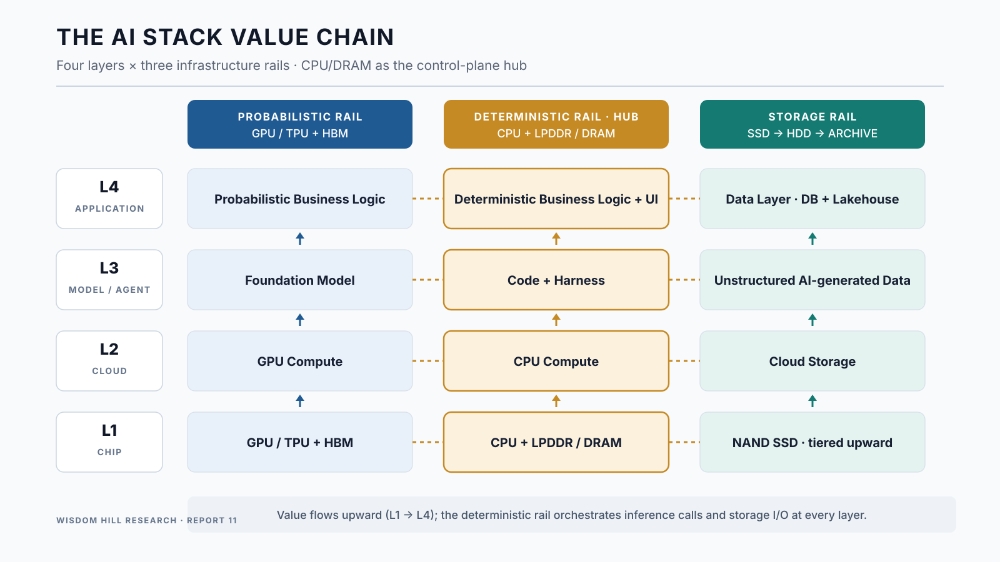

## 3.1 The chain and the rails

The AI stack is conventionally drawn as four layers — Chip (L1), Cloud (L2), Model (L3), Application (L4) — with value flowing upward. Drawn only vertically, however, the chain hides the fact that at every layer the stack runs on **two compute rails and one storage rail**. The probabilistic rail runs from GPU/TPU-plus-HBM silicon, through cloud GPU compute, through the foundation model, up to the probabilistic business logic of the application. The deterministic rail runs from CPU-plus-LPDDR/DRAM silicon, through cloud CPU compute, through the code-and-harness layer that controls the model, up to the application's deterministic business logic and interface. The storage rail runs from NAND SSD at its performance tier — tiering upward into HDD and archival classes, per Section 8 — through cloud storage, through the unstructured data the model layer generates, up to the application's data layer — databases and lakehouses.

**Table 1. The AI Stack value chain: four layers, three rails (Exhibit A)**

| Layer | Probabilistic rail — GPU/TPU + HBM | Deterministic rail — CPU + LPDDR/DRAM (hub) | Storage rail — NAND SSD (tiered upward) |
|---|---|---|---|
| L4 · Application | Probabilistic Business Logic | Deterministic Business Logic + UI | Data Layer (DB + LakeHouse) |
| L3 · Model (Agentic AI) | Foundation Model (probabilistic engine) | Code & Harness (deterministic control) | Unstructured Data (AI-generated) |
| L2 · Cloud | Compute (GPU) | Compute (CPU) | Storage |
| L1 · Chip | GPU/TPU + HBM | CPU + LPDDR | NAND SSD |

: {tbl-colwidths="[16,28,30,26]"}

*Value flows upward (L1→L4); CPU/DRAM sits in the middle column because it mediates between GPU compute and storage.*

**Figure 1. The AI Stack value chain: four layers, three rails, CPU as the hub.**

*Note: within each layer, the CPU rail is the control-plane hub — GPU inference calls are issued by CPU-resident harness code, and the CPU generally manages orchestration and I/O scheduling for the storage rail (direct GPU-to-storage paths such as GPUDirect Storage bypass host memory for the data transfer itself).*

## 3.2 The deterministic–probabilistic split as the spine

The middle column deserves the emphasis the diagram gives it. An agentic system is not a model; it is a model *wrapped in code*. The foundation model proposes; the harness — a deterministic program running on conventional CPUs — disposes: it assembles context, issues the inference call, executes the returned code, runs the tests, calls the tools, checks the results, and decides whether to loop. At L3 this is the Code & Harness element; at L4 it reappears as the deterministic business logic and UI that embed probabilistic outputs into products; at L2 and L1 it is simply server CPUs and their DRAM. The CPU rail is therefore the **hub** of the stack in a precise sense: it is the only rail that touches both others on every transaction. Every verification loop that Report 8's framework treats as the engine of token amplification is, physically, a CPU process invoking a GPU process and reading or writing storage. The taxonomy's foundational law — generation gated by verification — has a hardware translation: *probabilistic generation runs on the GPU rail; verification runs on the CPU rail; and the evidence both leave behind accumulates on the storage rail.*

## 3.3 What each rail is made of

At L1, the probabilistic rail is the accelerator complex: GPU or TPU die, HBM stacks bonded by advanced packaging, and the high-speed interconnect that shards models and KV caches across devices. The deterministic rail is the server CPU with conventional DRAM (DDR5 in the datacenter; LPDDR at the edge and increasingly in dense server designs). The storage rail is NAND flash in enterprise SSDs, tiered upward into object stores. At L2, hyperscalers already sell the three rails as distinct line items — GPU instances, CPU instances, storage — which is why cloud revenue disclosure will be among the earliest places the three-infrastructure mix becomes externally observable (Section 12). At L3 and L4, the rails become software categories: foundation models; agent harnesses, orchestration frameworks, and connectors; and the database/lakehouse layer whose control-plane character Report 8 developed under the semantic-layer thesis.

------------------------------------------------------------------------
