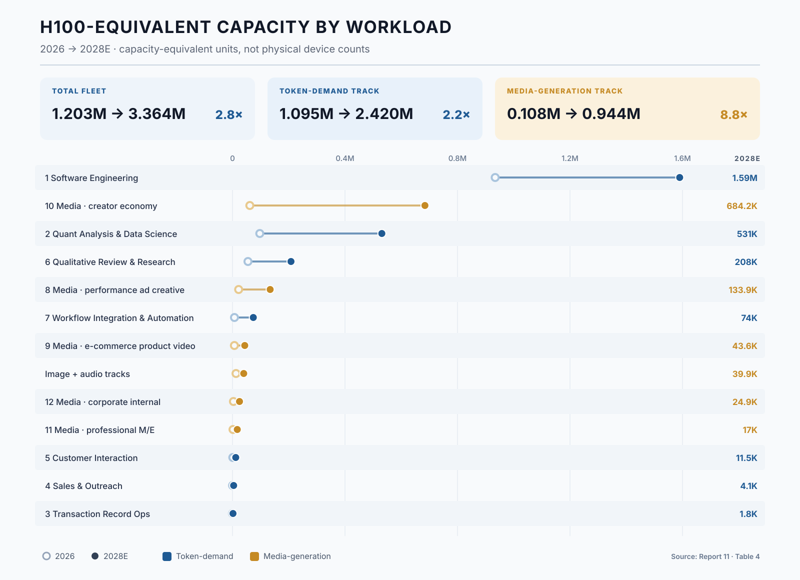

This is the chapter the companion reports promised, and the spine of this volume. It proceeds in seven steps: the conversion methodology; the fleet-by-function decomposition; the workload-profile analysis; the physics of the two tracks; the Great Decoupling; the composition of the 2028 fleet; and the divergence of the token, GPU, and revenue distributions.

## 6.1 Methodology: from frontier-equivalent tokens to H100-equivalents

The conversion rests on a single identity: **fleet (in H100-equivalents) = compute-weighted (frontier-equivalent) tokens ÷ T_g**, where T_g is the sustained frontier-equivalent token throughput one H100-equivalent delivers per year at target utilization. Everything in this section is the derivation of the identity's two terms and their allocation across functions. Every coefficient is explicit and adjustable in the companion workbook; as with the source models, the output is an order-of-magnitude instrument, not a point estimate — but the arithmetic between the inputs and Table 4 should be reproducible from this section for the LLM track, and from this section together with Report 10's Table 2 for the media rows.

**Calibrating T_g.** A single throughput constant across all seven LLM functions cannot represent the serving physics that separates them. The chat-style benchmark — 2,000 frontier-equivalent tokens per second at 40% utilization, or 25.23 billion tokens per GPU-year — is a reasonable description of short-context interactive serving and a poor one of everything else. An interactive agent loop carrying a hundred thousand tokens of context is KV-cache-limited: batch sizes collapse, and both throughput and achievable utilization fall well below a chat-style benchmark. A latency-tolerant batch job has neither constraint and saturates the device. A real-time voice workload is provisioned against peak concurrency and runs at low average utilization by construction. This report therefore assigns each function its own T_g:

| Function | Throughput (tok/s) | Utilization | T_g (bn frontier-equivalent tokens / GPU-year) | Serving regime |
|---|---:|---:|---:|---|
| 1 Software Engineering, 2 Quantitative Analysis | 1,400 | 28% | 12.36 | interactive, long-context, KV-cache-limited |
| 3 Transaction Ops, 4 Sales & Outreach | 2,200 | 55% | 38.16 | latency-tolerant batch |
| 5 Customer Interaction | 1,600 | 20% | 10.09 | real-time SLA, peak-provisioned |
| 6 Qualitative Review & Research | 1,200 | 40% | 15.14 | asynchronous, prefill-heavy |
| 7 Workflow Integration | 1,500 | 30% | 14.19 | connector chains, self-hosted open-weight serving |

: {tbl-colwidths="[24,11,11,22,32]"}

The Category 5 row carries a 1.5–3x latency penalty, modeled here to express the SLA constraint Report 8 identified qualitatively for real-time serving — that latency ceilings cap serving batch sizes, so effective hardware demand runs above what the token count implies. The range is this report's coefficient, not an inherited figure. It sits inside the utilization term rather than in the compute weight, since the constraint is provisioning against peak concurrency rather than model size. The spread between the highest and lowest T_g is nearly four-fold, which is the quantitative reason a single coefficient cannot be rescued by recalibration.

**The frontier-reference drift.** Compute weights are defined relative to the contemporary frontier model, so a frontier-equivalent token in 2028 is a claim on a larger model than the same token in 2026. We apply a drift multiplier of 1.00 / 1.15 / 1.30 to the LLM track across the three years — a mid path within a plausible 1.0–1.5 range by 2028. It is applied to the LLM track only; the media coefficients are already stated in GPU-hours and carry their own quality-tier structure.

**The per-function allocation rule.** Each function's fleet equals its compute-weighted tokens, multiplied by the year's drift, divided by that function's own T_g: fleet = (nominal tokens × compute weight × drift) ÷ T_g. One fully worked example, both endpoints, using Software Engineering (weight 0.70, T_g 12.36): in 2026, 16,500T nominal × 0.70 = 11,550T weighted, × 1.00 drift, so 11,550 ÷ 12.36 ≈ **934,000 H100-equivalents**; in 2028, 21,600T × 0.70 = 15,120T weighted, × 1.30 drift = 19,656T, so 19,656 ÷ 12.36 ≈ **1,590,000**. Every other row of Table 4 follows the identical calculation from the inputs in Table 4a.

**Table 4a. Derivation basis: nominal tokens × compute weight → frontier-equivalent tokens (trillions)**

::: {.content-visible when-format="html"}

| Function | Weight | T_g (bn/GPU-yr) | 2026 nominal | 2026 weighted | 2027 nominal | 2027 weighted | 2028 nominal | 2028 weighted |
|---|---:|---:|---:|---:|---:|---:|---:|---:|
| 1 Software Engineering | 0.70 | 12.36 | 16,500 | 11,550.0 | 19,500 | 13,650.0 | 21,600 | 15,120.0 |
| 2 Quant Analysis & Data Science | 0.60 | 12.36 | 2,003 | 1,201.5 | 4,806 | 2,883.6 | 8,411 | 5,046.3 |
| 3 Transaction Record Ops | 0.10 | 38.16 | 72 | 7.2 | 240 | 24.0 | 528 | 52.8 |
| 4 Sales & Outreach | 0.15 | 38.16 | 80 | 12.0 | 320 | 48.0 | 800 | 120.0 |
| 5 Customer Interaction | 0.20 | 10.09 | 48 | 9.6 | 192 | 38.4 | 448 | 89.6 |
| 6 Qualitative Review & Research | 0.80 | 15.14 | 1,037 | 829.4 | 1,872 | 1,497.6 | 3,024 | 2,419.2 |
| 7 Workflow Integration & Automation | 0.25 | 14.19 | 405 | 101.2 | 1,485 | 371.3 | 3,240 | 810.0 |
| **Total** | — | — | **20,144** | **13,711** | **28,415** | **18,513** | **38,051** | **23,658** |

: {tbl-colwidths="[20,6,9,11,11,11,11,11,10]"}

:::

::: {.content-visible when-format="typst"}

| Function | Weight | T_g (bn/GPU-yr) | 2026 nominal | 2026 weight­ed | 2027 nominal | 2027 weight­ed | 2028 nominal | 2028 weight­ed |
|---|---:|---:|---:|---:|---:|---:|---:|---:|
| 1 Software Engineering | 0.70 | 12.36 | 16,500 | 11,550.0 | 19,500 | 13,650.0 | 21,600 | 15,120.0 |
| 2 Quant Analysis & Data Science | 0.60 | 12.36 | 2,003 | 1,201.5 | 4,806 | 2,883.6 | 8,411 | 5,046.3 |
| 3 Transaction Record Ops | 0.10 | 38.16 | 72 | 7.2 | 240 | 24.0 | 528 | 52.8 |
| 4 Sales & Outreach | 0.15 | 38.16 | 80 | 12.0 | 320 | 48.0 | 800 | 120.0 |
| 5 Customer Interaction | 0.20 | 10.09 | 48 | 9.6 | 192 | 38.4 | 448 | 89.6 |
| 6 Qualitative Review & Research | 0.80 | 15.14 | 1,037 | 829.4 | 1,872 | 1,497.6 | 3,024 | 2,419.2 |
| 7 Workflow Integration & Automation | 0.25 | 14.19 | 405 | 101.2 | 1,485 | 371.3 | 3,240 | 810.0 |
| **Total** | — | — | **20,144** | **13,711** | **28,415** | **18,513** | **38,051** | **23,658** |

: {tbl-colwidths="[25,6,9,11,9,11,9,11,9]"}

:::

*Weighted figures, multiplied by the year's drift factor (1.00 / 1.15 / 1.30) and divided by each function's T_g, yield the fleet counts of Table 4. Category rows are rounded independently and may differ from the displayed totals by one unit.*

On this basis, **B2B LLM inference requires approximately 1,095,000 H100-equivalents in 2026, 1,688,000 in 2027, and 2,420,000 in 2028.**

**The unweighted counterfactual, and the error it removes.** The payoff of the weighted methodology is visible by running the nominal token totals through a single conversion. Using the legacy uniform T_g of 25.23 billion tokens per GPU-year for both series, the nominal totals imply roughly 798,000 H100-equivalents in 2026 and 1,508,000 in 2028, against 543,000 and 938,000 on the compute-weighted series — the weighted requirement running 38% below the nominal conversion in 2028, a wedge that widens over time precisely because the fastest-growing token categories (3, 4, 5, 7) carry the lightest compute weights. This is Report 8's 32–38% token-versus-compute divergence expressed in GPUs. The function-specific conversion this report actually uses lands higher than either legacy figure — 2,420,000 in 2028 — because realistic serving throughput for the dominant interactive workloads is roughly half the chat-style benchmark and the frontier reference itself drifts upward. The two corrections work in opposite directions, and the naive path gets both wrong: it overstates by ignoring model mix and understates by assuming benchmark throughput.

**Stated simplifications, with sign.** The deliberate simplifications cut in known directions, and we state them rather than net them silently. The conversion still does not decompose prefill and decode, which matters increasingly for Category 6 as machine cross-review spreads and its token mix shifts toward prefill. No provisioning headroom is added for regional replication or build-ahead, on the view that the utilization terms already carry peak and redundancy allowance; a reader who disagrees should scale the whole LLM track. Routing maturation drifting Category 1's effective weight below 0.70 presses downward, while the frontier drift beyond 1.30 presses upward. Training demand is excluded entirely, which understates total accelerator demand but keeps the model a clean inference instrument. The media track adds its separately derived fleet — **≈108,000 H100-equivalents in 2026 rising to ≈944,000 in 2028** — imported from Report 10's GPU-hour series by the segment-specific utilization conversion Section 6.2 sets out.

## 6.2 The fleet by function: two giants and a fast-growing middle

Allocating each function's compute-weighted tokens against the fleet total by the rule of Section 6.1 yields the decomposition in Table 4 — the single most information-dense exhibit in this report. The seven LLM rows follow mechanically from Table 4a; the media rows disaggregate Report 10's fleet into its five segments and the supplementary image and audio tracks, by the utilization conversion developed immediately below the table.

**Table 4. H100-equivalent inference fleet by workload, 2026–2028 (Exhibit C)**

| # | Function | 2026 | 2027 | 2028 | 2026→28 | Silicon character |
|---|---|---:|---:|---:|---:|---|
| 1 | Software Engineering | 934,000 | 1,270,000 | 1,590,000 | 1.7x | HBM bandwidth-bound |
| 2 | Quant Analysis & Data Science | 97,000 | 268,000 | 531,000 | 5.5x | HBM bandwidth-bound |
| 3 | Transaction Record Ops | 200 | 700 | 1,800 | 9.5x | batch / budget |
| 4 | Sales & Outreach | 300 | 1,500 | 4,100 | 13.0x | batch / budget |
| 5 | Customer Interaction | 1,000 | 4,400 | 11,500 | 12.1x | latency-provisioned |
| 6 | Qualitative Review & Research | 55,000 | 114,000 | 208,000 | 3.8x | prefill-heavy / HBM |
| 7 | Workflow Integration & Automation | 7,000 | 30,000 | 74,000 | 10.4x | connector / light |
| | **Token Track subtotal (1–7)** | **1,095,000** | **1,688,000** | **2,420,000** | **2.2x** | |
| 8 | Media: performance ad creative | 21,900 | 58,400 | 133,900 | 6.1x | dense-FLOP, batch |
| 9 | Media: e-commerce product video | 6,700 | 21,500 | 43,600 | 6.5x | dense-FLOP, batch |
| 10 | Media: creator economy | 61,600 | 256,600 | 684,200 | 11.1x | dense-FLOP, interactive |
| 11 | Media: professional M/E | 1,800 | 8,100 | 17,000 | 9.6x | dense-FLOP, batch |
| 12 | Media: corporate internal | 3,300 | 11,200 | 24,900 | 7.5x | dense-FLOP, batch |
| | Image and audio tracks | 12,500 | 23,200 | 39,900 | 3.2x | dense-FLOP, batch |
| | **Media Track subtotal (8–12 + tracks)** | **108,000** | **379,000** | **944,000** | **8.8x** | |
| | **Total** | **1,203,000** | **2,068,000** | **3,364,000** | **2.8x** | |

: {tbl-colwidths="[4,28,11,11,11,10,25]"}

*The diffusion rows are Report 10's fleet-equivalents at segment-specific utilization rates; see the derivation below. The image and audio tracks are supplementary to the five video segments and serve the same customers. Rows are rounded independently and may not sum exactly to the subtotals. Elsewhere in this report — Tables 3 and 5, and the qualitative gradings of Sections 7 to 9 — the Media Track is treated as a single function, Generative Media, because its three-rail signature is uniform across the five segments.*

**Figure 2. H100-equivalent accelerator capacity by workload — the two giants, and the two demand tracks distinguished by color.**

**How the media row is derived.** The media fleet is not converted from tokens — diffusion generation has no token unit — but from Report 10's GPU-hour series directly. That series puts commercial media generation at 403 million GPU-hours in 2026 and 3,392 million in 2028, derived from delivered minutes through the two-pass exploration-and-finishing structure summarized in Section 5.1. The conversion to a fleet uses utilization rates that differ by segment rather than one rate for the track, because the serving patterns differ as sharply within media as they do within the LLM categories. Enterprise pipelines that queue jobs — e-commerce conversion, corporate video, studio rendering — sustain roughly 55%, materially higher than any interactive LLM workload, because diffusion is compute-bound batch work with no latency obligation. Self-serve advertising runs near 45%. Individual creators, who carry most of the track's compute, run at 38%: they generate inside interactive sessions, waiting on each result before prompting again, which is a latency-bound pattern much closer to Category 5 than to batch rendering. Applying these rates yields **108,000 H100-equivalent accelerator units in 2026 and 944,000 in 2028**.

Because the creator segment dominates, the 38% rate does more to set the media total than any other utilization assumption in this report. Diffusion saturates its hardware where the work can be queued; where a human is waiting on each result, it does not. One normalization caveat governs every combined total here. Report 10 states its media figures as H100-equivalent capacity, and this report adopts that definition; but the underlying GPU-hour coefficients are engineering assumptions calibrated to published throughput and pricing rather than hardware-specific measurements, so the figures denote normalized compute capacity rather than a count of physical H100 devices. The same is true of the LLM track, where production serving mixes GPUs, TPUs, and inference ASICs. Combined totals should accordingly be read as conditional capacity-equivalent aggregates, and the LLM and media rows of Table 4 are stated distinctly so that a reader who prefers to keep the two units apart can do so.

Four readings of the table. First, **the two giants, on two tracks.** Software Engineering alone is a 934,000-GPU workload in 2026 — roughly six times every other LLM function combined — and remains the largest single function at 1,590,000 by 2028, though its 1.7x multiple is the table's lowest, consistent with Report 8's finding that coding's growth peaks in 2026 and decelerates thereafter. The Media Track as a whole is the second giant and the fast one: from roughly 12% of the coding fleet in 2026 to roughly 59% by 2028. Disaggregating it changes the picture of where that mass sits. The creator economy alone reaches 684,000 accelerators by 2028 — the second-largest individual function in the model, ahead of Quantitative Analysis — while professional media and entertainment, the segment a casual reading would expect to dominate, requires 17,000. Together, Software Engineering and the creator economy account for roughly two-thirds of all AI inference silicon in this model, which is not the pairing most capacity plans are built around.

Second, **the flow diverges from the stock.** The fleet grows by roughly 2,161,000 accelerators between 2026 and 2028, and generative media contributes about 836,000 of that increment against software engineering's 656,000. The largest workload and the largest source of *new* demand are not the same function — the single most consequential fact in this table for anyone provisioning capacity rather than describing it. Read year by year, the requirement adds roughly 865,000 capacity-equivalents in 2027 (about 593,000 on the Token Track, 271,000 on the Media Track) and roughly 1,296,000 in 2028 (732,000 and 565,000): the Media Track's share of each year's additions rises from about 31% to about 44%, and at the 1.35 kW reference the annual additions correspond to roughly 1.2 GW and then 1.75 GW of new facility-load equivalent.

Third, **the fast-growing middle.** Quantitative Analysis (5.5x to 531,000) becomes the third GPU workload and the clear inheritor of the growth coding relinquishes, while Qualitative Research (3.8x to 208,000) takes fourth on the strength of the highest compute weight in the model. Workflow Integration reaches 74,000 despite its light 0.25 weight, purely on token volume, and performance advertising reaches 134,000 on the diffusion side. Below the two giants, the middle of the table is now mixed across tracks rather than being an LLM phenomenon with media bolted on.

Fourth, **the trivial tail that isn't trivial elsewhere.** Functions 3, 4, and 5 jointly command about 17,000 H100-equivalents even in 2028 — under 1% of the fleet — despite holding 4.7% of nominal tokens and despite roughly 10–13x growth over the period. Their batch tolerance is what shrinks them: at 38 billion tokens per GPU-year, Categories 3 and 4 extract three times the throughput of an interactive agent loop from the same silicon. Large token counts, small GPU claims, large storage claims (Section 8) — the four-distribution principle made concrete.
