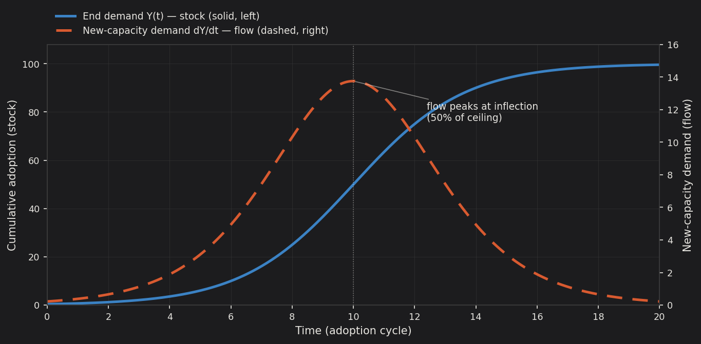

## 2.1 Stock versus flow: the structural relationship between the two industries

The semiconductor industry and the datacenter industry stand in a supplier–customer relationship, but the economically decisive feature of that relationship is not who sells to whom. It is that the two sides of the transaction live in different dimensions of the same variable. Datacenter capacity is a *stock*: an accumulated quantity of installed compute, measured at a point in time. Semiconductor output is a *flow*: a rate of production, measured per unit of time. The relationship is most visible at its center: hyperscale datacenter operators accumulate a stock of installed accelerators, and NVIDIA, as the dominant merchant supplier, sells the flow that changes it. Every chip sold either adds to the stock (new capacity) or maintains it (replacement of depreciated equipment). The chip supplier's revenue line is therefore not a picture of how much AI computing the world does; it is a picture of how fast the world is *changing* how much AI computing it does.

This distinction, elementary as it sounds, is the single most consequential fact in the economics of the AI hardware cycle, because it means semiconductor demand is mathematically a derivative of end demand — and derivatives are more volatile than the functions they are taken from. One qualification governs how forcefully the derivative reaches the supplier. A firm that must build to defend share takes the derivative into volume and capacity commitments; a firm facing no credible substitute can take more of it into price and margin, smoothing its own revenue and leaving the volatility with its customers. The mechanism operates either way; its amplitude depends on how contestable the market is — a condition Chapter 6 examines for accelerators.

## 2.2 The accelerator principle

Let $Y(t)$ denote demand for datacenter services and let the capacity stock required to serve it be proportional: $K^*(t) = vY(t)$, where $v$ is the capital coefficient. Chip demand decomposes into a new-investment term and a replacement term:

$$
D_{semi}(t) \;=\; \underbrace{v \cdot \frac{dY}{dt}}_{\text{net capacity additions}} \;+\; \underbrace{\delta \cdot K(t)}_{\text{replacement demand}}
$$

where $\delta$ is the depreciation rate of installed equipment. The first term is the heart of the matter. Because it is proportional to the *time derivative* of end demand, the semiconductor industry does not require end demand to decline in order to experience a contraction. It only requires end demand to decelerate. If datacenter service demand downshifts from 30 percent annual growth to 15 percent annual growth — a trajectory most observers would describe as robustly healthy — the new-investment component of chip demand, holding the demand level constant, falls by half. Across consecutive periods the larger demand base partly offsets the lower growth rate — demand rising from 100 to 130 adds 30, and a subsequent 15 percent year adds 19.5, a decline of roughly a third rather than half — but the qualitative point stands: a mere halving of the *growth rate* produces an outright contraction in the *level* of new-investment chip demand. This is the accelerator principle, formulated by Clark (1917) and later integrated with the multiplier by Samuelson (1939) — "accelerator" here in its century-old macroeconomic sense, unrelated to the AI accelerator chips discussed elsewhere in this report — and it is the fundamental reason capital-goods industries exhibit wider cyclical amplitude than the final-demand industries they serve.

The replacement term $\delta K$ provides a floor under the flow, and its size matters for the depth of any downturn. Two features of the current cycle make this floor higher than in past hardware cycles: AI accelerators depreciate quickly relative to general-purpose servers, raising $\delta$, and the installed stock $K$ is growing rapidly. The floor rises — but a floor is not a ceiling, and the cyclical violence lives in the first term.

## 2.3 The S-curve and its derivative: why the peak arrives early

Technology adoption empirically follows a logistic (S-shaped) path (Rogers 2003): slow initial uptake, an acceleration phase, an inflection, deceleration, and saturation. Write adoption as

$$
Y(t) = \frac{L}{1 + e^{-r(t - t_0)}}
$$

where $L$ is the saturation level, $r$ the adoption speed, and $t_0$ the inflection point. The derivative —

$$
\frac{dY}{dt} = \frac{rL \, e^{-r(t - t_0)}}{\left(1 + e^{-r(t - t_0)}\right)^2}
$$

— is a bell-shaped curve (formally, the density of the logistic distribution, closely resembling a Gaussian). The decisive property is the location of its peak: the flow of new demand reaches its maximum at $t_0$, the moment adoption passes 50 percent of its eventual ceiling, and declines monotonically thereafter even as cumulative adoption continues to rise toward $L$.

The implication is the one markets most consistently misread. The statements "AI demand continues to grow" and "semiconductor demand is contracting" are not in tension; they describe the same moment on the curve. What determines the fate of the chip supplier is not the level of end demand, nor even its first derivative in isolation, but the *sign of the second derivative*. At the inflection point — where $d^2Y/dt^2$ turns negative — every headline indicator of end demand is still setting records. Usage is at all-time highs, growth remains strong by any historical standard, and the deceleration is visible only in second differences that are noisy in real time and confirmed only in hindsight. The pressure on new-capacity chip demand begins at precisely the moment the end-demand narrative appears most secure.

**Exhibit 1. The stock and its flow.** The end-demand curve $Y(t)$ (solid, left axis) rises monotonically toward saturation, yet the flow of new-capacity demand $dY/dt$ (dashed, right axis) is bell-shaped and peaks at the adoption inflection — the point at which cumulative adoption reaches roughly half of its eventual ceiling. Beyond that point, new-capacity chip demand declines in absolute terms even as end demand continues to set record highs. The divergence of the two curves is the analytical core of the cycle: the flow peaks and turns down while the stock is still climbing. The new-capacity component of chip demand turns while the customer's usage is still setting records; total semiconductor demand and supplier revenue follow with a lag shaped by replacement demand, pricing, and market share.

## 2.4 The amplification chain: derivatives stacked on derivatives

The derivative relationship does not operate once; it compounds at each upstream step of the value chain. End demand for AI services drives datacenter capacity investment, which is the first derivative. Chip orders respond to capacity investment with the additional distortions of inventory cycles and double-ordering, layering the bullwhip effect (Forrester 1961; Lee, Padmanabhan, and Whang 1997) on top of the accelerator. Semiconductor equipment orders, in turn, respond to *chip-capacity* investment — a derivative of a derivative of end demand. Each step upstream therefore exhibits greater amplitude than the one below it, which is why equipment makers have historically been the most violent cyclicals in the chain and why their order books function as the most sensitive leading indicator of the whole system. One further link matters for what follows: high-bandwidth memory is not sold into the datacenter on its own but bundled onto the accelerator, so its AI demand is derived from the accelerator flow rather than from the datacenter directly — a derivative one step further removed, with consequences developed in Chapter 7.

Two information pathologies amplify the chain further. During shortages, customers double-order across suppliers to secure allocation, so the demand signal reaching chip makers overstates true end demand at exactly the moment capacity decisions are being made. During slowdowns, customers work down inventory before placing new orders, so the signal understates true demand at exactly the moment capitulation pressure peaks. The supply chain thus transmits not the derivative of demand but an *exaggerated* derivative — and capacity, once built in response to the exaggeration, does not go away.

------------------------------------------------------------------------
